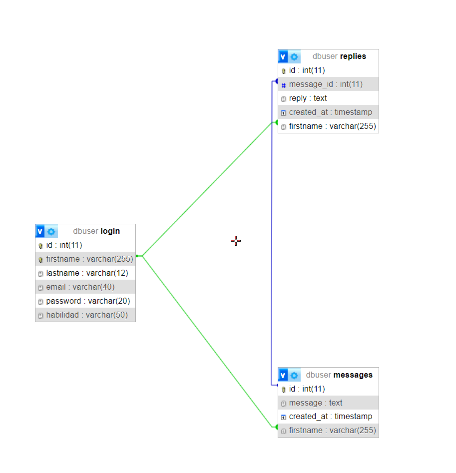

# Proyecto Programacion
Realizado por Romeo Dominguez y Pablo de la Sierra.

## ShareSkills

#### 1. Explicacion del diseño y concepto de nuestra web.
- Hemos querido enfocar nuestro web como si se tratase de un foro, los usuarios pueden añadir habilidades a sus perfiles para poder participar y ayudar a otros usuarios. No es necesario tener una habilidad para pedir ayuda en el foro. 
#### 2. Formulario de inicio de sesion y/o registro en la web.
- El proceso para crearte un cuenta de usuario es bastante simple, simplemente hemos implementado un formulario de registro con datos basicos. Los usuarios incialmente se crearan sin ninguna habilidad, ya que por lo general el usuario pide ayuda. Sin embargo posteriormente los usuarios pueden modificar sus habilidades y conocimientos. Las habilidades de los usuarios puedes ser modificadas por ellos mismos, pueden añadir habilidades o eliminarlas.
### 3. Tipos de usuarios.
##### 3.1 Solicitante
- Al registrar este usuario inicialmente no tendra ninguna habilidad asignada, por lo que podra recibir ayuda pero no darla.
##### 3.2 Contribuyente
- Al mismo que el tipo de usuario "Solicitante" no tendra ninguna habilidad asignada inicialmente, pero podra añadirla posteriormente en su perfil de usuario. Este tipo de usuario podra dar y recibir ayuda.
##### 3.3 Administrador
- Al iniciar sesion con las credenciales de un adminstrador nos redireccionara al perfil del administador donde podremos:
    - Eliminar usuarios.
    - Modificar usuarios.
    - Eliminar Ayudas.
    - Modificar Ayudas.
    - Crear mensajes de ayudas.
    - Eliminar los mensajes de las ayudas.
#### 4. Foro
- Hemos creado un foro donde pueda participar cualquier usuario. Hemos organizado nuestro foro como si fuera "discusiones", es decir, el usuario que ha pedido ayudar crea el primer mensaje, despues si otro usuario quiere ayudarle entrara en esa "discusion" y podra enviar un mensaje ayudando al otro usuario. Hemos añadido la fecha de creacion de la "discusion" para concienciar al usuario que quiera escribir en el foro el dia de creacion que tuvo esa ayuda.
- Ademas hemos añadido un buscador para que el usuario pueda buscar por habilidades o palabras clave.

## Base de datos
La base de datos dbuser la hemos diseñado para gestionar la información relacionada con usuarios, mensajes y respuestas de la pagina web.
- Breve descripcion de la estructura y relaciones entre las tablas:
- Tabla login: Esta tabla almacena la información de los usuarios registrados en el sistema.
    - La tabla login tiene una relación uno a muchos con las tablas messages y replies, donde la columna firstname se utiliza como clave externa que referencia al nombre del usuario.
- Tabla messages: Esta tabla almacena los mensajes enviados por los usuarios. 
    - La tabla messages tiene una relación muchos a uno con la tabla login, donde la columna firstname se utiliza como clave externa que referencia al nombre del usuario que envió el mensaje.
- Tabla replies: Esta tabla almacena las respuestas a los mensajes. 
    - La tabla replies tiene relaciones muchos a uno tanto con la tabla login como con la tabla messages. La columna firstname se utiliza como clave externa que referencia al nombre del usuario que envió la respuesta, y la columna message_id se utiliza como clave externa que referencia al mensaje al que se está respondiendo.
- Este es el diagrama de clases:

## Metodo de trabajo
- Hemos trabajado de manera simultanea, primero creamos la idea del proyecto y creamos un esquema basico de lo que queriamos que contuviese el mismo. Hemos divido los apartados del proyecto para poder realizarlo mas facilmente y una vez hemos tenido que entrar en mas detalles o pulir alguna funcion hemos trabajado en grupo. Con esta forma de trabajo hemos conseguido realizar los requisitos minimos facilmente y una vez los complimos pulir el proyecto he implmentar mejoras en el mismo.

